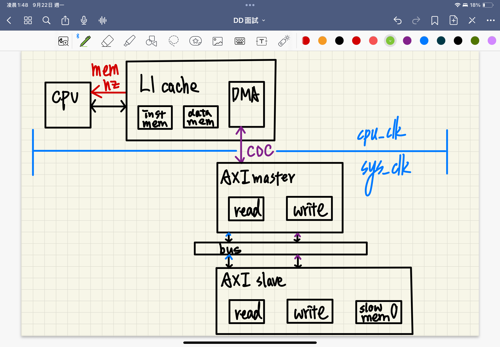

popo risc-v SoC 
===

## goal



I want to build a simplified risc-v SoC chip. It contains three module: five stage pipelined CPU, L1 cache, AXI4 bus. CPU interact with L1 cache to get the instruction and data. L1 cache stores data by SRAM and maintain SRAM's content with the help of DMA, which handles data transfer through AXI master. AXI bus connect AXI master to AXI slave through AXI interconect, where AXI slave maintains an DRAM.

The system should has two clk, one fast clk for CPU and L1 cache and the other slow clkk for AXI related component. CDC problems arises in-between DMA and AXI maste. I introduce afifo, double sync, ready valid to tackle CDC.

```
chip
├── cpu
│   ├── IF/ID/EX/MEM/WB/forward unit/hazard unit/...
│   ├── regfile
├── L1 cache
│   ├── fastest data mem
│   ├── fastest inst mem
│   ├── dma
│       ├── middle SRAM
├── AXI bus
│   ├── AXI master
│   ├── AXI interconnect
│   ├── AXI slave
│       ├──── slow DRAM
```
## progress

For now, these three module has not ....

## how to run

- step0: clone main repo and enter the main working directory
    
    $ git clone https://github.com/108062138/popo_cpu.git
    
    $ cd popo_cpu

- step1: clone asm to hexa repo and make the python env aware of the python extension
    
    $ git clone https://https://github.com/108062138/riscv-assembler.git
    
    $ pip install -e ./riscv-assembler

- step3: change file path when possible

If issues arise try:

    $ python3 -m pip install riscv-assembler