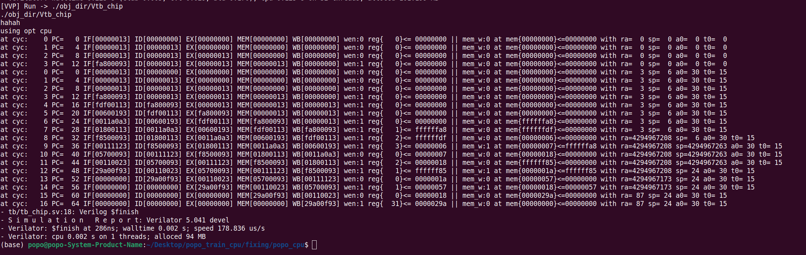
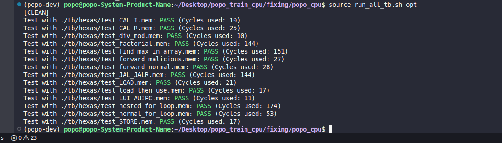
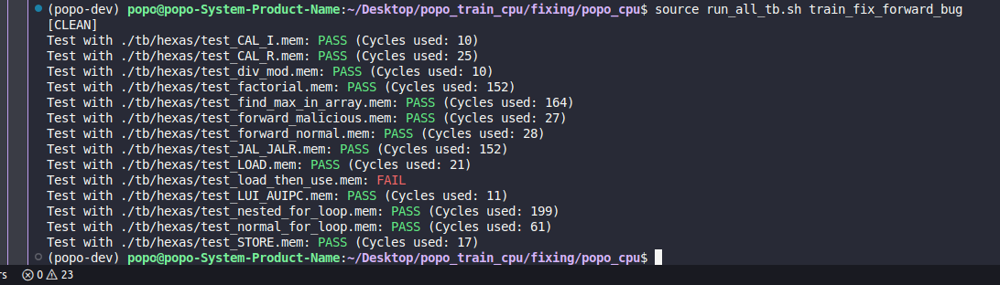

popo risc-v SoC 
===

## goal


I want to build a simplified risc-v SoC chip. It contains three module: five stage pipelined CPU, L1 cache, AXI4 bus. CPU interact with L1 cache to get the instruction and data. L1 cache stores data by SRAM and maintain SRAM's content with the help of DMA, which handles data transfer through AXI master. AXI bus connect AXI master to AXI slave through AXI interconect, where AXI slave maintains an DRAM.

The system should has two clk, one fast clk for CPU and L1 cache and the other slow clkk for AXI related component. CDC problems arises in-between DMA and AXI maste. I introduce afifo, double sync, ready valid to tackle CDC.

```
chip
├── cpu
│   ├── IF/ID/EX/MEM/WB/forward unit/hazard unit/...
│   ├── regfile
├── L1 cache
│   ├── fastest data mem
│   ├── fastest inst mem
│   ├── dma
│       ├── middle SRAM
├── AXI bus
│   ├── AXI master
│   ├── AXI interconnect
│   ├── AXI slave
│       ├──── slow DRAM
```
## progress

For now, these three module has not been connected yet. And they are not finished, independently.

- AXI bus: finish burst mode but interconnect module is not done yet. The currect setup is to 1-1 mapping, which is not realistic
- L1 cache: the memory calling DMA should be re-implemented. And the memory maintains should add TLB and so on
- five stage CPU: the CPU's branch is fixed, should use 4-state branch detection unit to replace it. the CPU's current jal, jalr is detected in EX stage, which always causes flush. I want it to move to ID stage, eliminating the need to flush ID/EX and add branch prediction module.

## how to run

step 0: clone main repo and enter the main working directory
    
    $ git clone https://github.com/108062138/popo_riscv_cpu.git
    
    $ cd popo_riscv_cpu

step 1: (selective)clone asm to hexa repo and make the python env aware of the python extension. You can directly copy `tb/hexa/?.mem` into `tb/word_inst.mem` to walk around step 1. Any modification in assembly code requires an re-compilation it into its corresponding instruction mem. To do so, we have to re-run `compile_all_tb.py` again.
    
    $ git clone https://https://github.com/108062138/riscv-assembler.git
    
    $ pip install -e ./riscv-assembler

    $ python3 compile_all_tb.py

step 2: change file path when possible in src/L1_cache/inst_mem accordingly. Let's say I want to `test_load_then_use` testcase.

    $ cp tb/hexa/test_load_then_use.mem tb/word_inst.mem

step 3: use makefile to run. for now, I provide two version of cpu to use: naive and opt, which can be specified by `CPU_VERSION`. Several versions are supported: `basic`, `opt`, `train_fix_bug_forward_bug`. An success run should appear like the following screenshoot.

    $ make sim_chip CPU_VERSION=opt



## auto test

shell script `run_all.sh` is provided to enable auto test. Type the following command to test all tb and the result is stored in `sim_out`.

    $ chmod 777 run_all.sh

    $ ./run_all.sh

|   | bug-free  | bug  |
|---|---|---|
| img  |   |   |